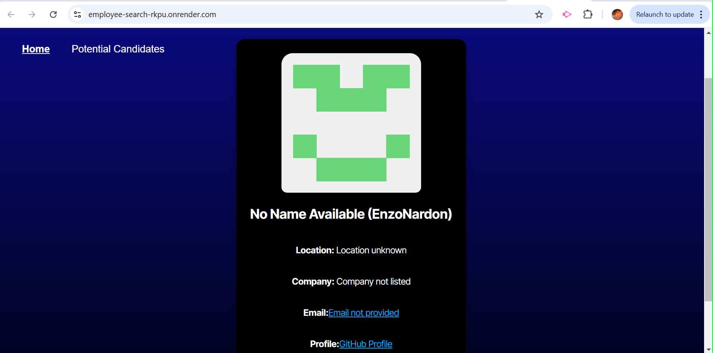

# Employee-Search

## Description
This project is a Candidate Search Application that fetches data from the GitHub API and renders user details in the browser. The application's backend has already been created, and this project focuses on completing the front-end using TypeScript, integrating the API, and deploying the final application to Render.


## Badge
None.


## Table of Contents
- [Installation](#installation)
- [Usage](#usage)
- [License](#license)
- [Contributing](#contributing)
- [Test Instructions](#testinstructions)
- [Questions](#questions)
   

## Installation 
1. Clone the Repository:
```
git clone <respository-SSH key>
cd Employee-Search
```
2. Navigate to the project directory:
```
cd Employee-Search
```
3. Install the necessary ependencies:
```
npm install
```

4. Create a ```.env``` File:

```
VITE_GITHUB_TOKEN=your_github_personal_access_token
```

5. Run the application locally:

```
npm run dev
```

Your portfolio should now be running locally at ```http://localhost:5173``` (or a different port if specified).


## Usage 
Naviagte to the site: https://employee-search-rkpu.onrender.com

To use the application, click the green button or red button on the different profiles, and the app will fetch user details from the GitHub API and display them in the browser. 


## License 
This project is not licensed. 


## Contributing 
Contributions are welcome! To contribute:
1. Fork the repository.

2. Create a new branch:
```
git checkout -b feature/yourFeature
```

3. Commit your changes:
```

git commit -m "Add new feature"
```

4. Push to your branch:
```

git push origin feature/yourFeature
```

5. Open a pull request for review.


## Test Instructions 
To test the application's functionality:

-  Run Unit Tests
```npm test```

-  Manual Testing

-  API rate Limit Hnadling
    -If you reach GitHub's rate limit, verify that the app shows an appropriate warning message.


## Questions 
If there's any additional questions I can answer for you, you can reach out to me at https://github.com/je210506 or [lalanne1011@gmail.com](mailto:lalanne1011@gmail.com}).

